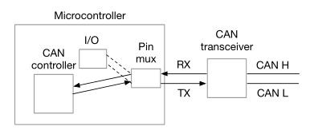

# CANHack MicroPython SDK

### 6. CANHack MicroPython SDK

### 6.1 Introduction

There are two ways to mount an attack on a CAN bus. The simplest is a _frame attack_: to use existing CAN hardware – the CAN controller – to send frames on the bus. For example, to send a spoof frame. Or to send frames at such a rate that legitimate frames are slowed or prevented: a _flood attack_ (in a real-time system, a message arriving late is a failure of the system). The other way to mount an attack is to by-pass the CAN hardware and drive carefully crafted signals directly on to the bus: a CAN _protocol attack_.&#x20;

A CAN protocol attack uses software to drive signals that exploit low-level features of the CAN protocol itself. For example, the Bus Off attack uses the CAN error confinement rules to disconnect a targeted ECU from the bus. A CAN protocol attack uses direct access to the standard component that all ECUs contain: the CAN transceiver. The transceiver is a chip that converts between the digital TX and RX I/O from the CAN controller and the analog voltages of CAN H and CAN L on the twisted pair CAN wire. Normally the TX and RX pins are driven by a CAN controller but in most ECU electronics this controller is integrated inside a single microcontroller chip alongside the CPU, RAM, etc. But software can disable the CAN controller and take control of the I/O pins directly (using the pin mux that is present in some form on all microcontrollers).



With carefully written software it is possible to drive the TX pin quickly enough to emulate parts of the CAN protocol and mount protocol attacks. The CANHack toolkit is designed to prove that this is a viable attack mechanism.&#x20;

The CANHack software is provided as generic C that ‘bit bangs’ the TX pin using spin loops. It has been ported to the RP2040 microcontroller in the Raspberry Pi Pico and been wrapped with a Python API in custom MicroPython firmware for the Raspberry Pi Pico, and firmware is provided for three different boards:

* The Canis Labs (canislabs.com) CANPico board1, that has a CAN transceiver shared with a Microchip MCP2517FD CAN controller connected over SPI.
* &#x20;The Canis Labs CANHack board.&#x20;
* The Car Hacking Village DEF CON 30 badge from Intrepid Control Systems (intrepidcs.com)

The generic C and the MicroPython API code are available in the Canis Labs repository: [https://github.com/kentindell/canhack](https://github.com/kentindell/canhack)

_See https://kentindell.github.io/2021/05/24/canpico-intro/ for more about the CANPico_

The CANHack toolkit attacks implements the following attacks:

* Targeted and overwrite spoofing attacks&#x20;
* Bus Off attack&#x20;
* Error Passive attack&#x20;
* Janus2 attack&#x20;
* Double Receive3 attack&#x20;
* Freeze Doom Loop4 attack

The API also contains diagnostic functions for setting the bus to dominant or recessive, putting a square wave on to the bus, and sending a defined CAN frame.

As well as providing the CANHack toolkit API there are some other features included in the firmware:

&#x20;\- A second USB serial port is included (so when the Pico connects to a host, two virtual ports are instantiated5).

&#x20;\- An implementation of the MIN (Microcontroller Interconnect Network) protocol6.

Before going any further there is an important caveat:

> <mark style="color:red;">WARNING. Connecting the CAN hardware directly to a vehicle CAN bus comes with risk and should not be undertaken without understanding this risk. Grounding a vehicle chassis through the USB port of a Pico connected to a laptop, PC or USB hub powered from the mains may cause permanent damage to the vehicle’s electronics and/or the Raspberry Pi Pico and devices it is connected to. The CAN transceiver will tolerate a ground potential difference (“ground offset”) of between -2V/+7V. Connecting pin 2 of the screw terminal to the target system’s ground will establish a common ground reference. The CAN bus must be properly terminated (with 120W resistors at either end). If the CAN bus is already terminated at both ends then the termination on the board should not be engaged. In addition, causing disruption to a vehicle’s CAN bus traffic may be interpreted by the vehicle fault management systems as a hardware fault and cause the vehicle to permanently shut down CAN communications with consequent loss of functionality.</mark>

### 6.2 CANHack Python API

The CANHack toolkit is provided as a single class `CANHack`.

**6.2.1 CANHack — CANHack toolkit**&#x20;

**class CANHack**( \[ _bitrate_=_500_ ] )&#x20;

Initializes the CANHack toolkit.

> <mark style="color:red;">If running on a CANPico, this constructor must be called after the CAN controller TX output is put into open drain mode (by setting the CAN controller</mark> <mark style="color:red;"></mark>_<mark style="color:red;">tx\_open\_drain</mark>_ <mark style="color:red;"></mark><mark style="color:red;">parameter to</mark> <mark style="color:red;"></mark>_<mark style="color:red;">True</mark>_<mark style="color:red;">).</mark>

Raises

* _`ValueError`_` ``` – if bit\_rate is not one of 500, 250, or 125

**Methods**

**set\_frame**_(\[can\_id=0x7ff] \[, remote=False] \[, extended=False] \[, data=None] \[, set\_dlc=False] \[, dlc=0] \[, second=False] )_

Set the specified frame buffer.&#x20;

The frame buffer is an internal buffer in RAM in the toolkit that pre-defines the bit sequence for a CAN frame (pre-calculating where the stuff bits go, etc.)&#x20;

This function pre-computes the layout of a CAN frame into a frame buffer inside the toolkit (it will set the shadow frame buffer is second is True because the Janus Attack7 requires two separate CAN frames).&#x20;

This method must be called prior to mounting an attack: the pre-computed bit pattern in the frame buffer is used to synchronize the attack on a targeted frame.

**Parameters**&#x20;

* **can\_id** (_int_)– An 11-bit or 29-bit integer representing the CAN ID of the frame&#x20;
* &#x20;**remote** (_bool_) – True if the frame is a remote frame
* &#x20;**extended** (_bool_) – True if can\_id is a 29-bit CAN identifier&#x20;
* **data** (_bytes_) – The payload of the CAN frame
* **set\_dlc** (_bool_) – True if the DLC should be set to a specific value
* **dlc** (_int_) – the value of DLC if set\_dlc is True
* **second** (_bool_) – True if this call is setting the shadow frame in preparation for the Janus Attack

**Raises**

* `ValueError` – if the _dlc_ value is > 15 or if the payload is more than 8 bytes or remote is _True_ and _data_ is set

For more details on the Janus Attack see: https://kentindell.github.io/2020/01/20/new-can-hacks/

**Returns** _None_&#x20;

**get\_frame**( \[, _second=False_] )&#x20;

Return details of the specified frame buffer.

**Parameters**

* **second** (_bool_) – _True_ if the details of the shadow frame buffer should be returned

**Return type** tuple&#x20;

**Raises**

* &#x20;`ValueError` – if the selected frame buffer has not been set by a prior call to _set\_frame_()

The method returns an 8-element tuple of:

\- A string representing the frame bitstream (including stuff bits) with '1' and '0' characters for the bits

\- A string representing where the stuff bits are located (with 'X' being a stuff bit and '–' being a data bit)

\- The integer index of the last arbitration bit in the bitstream

\- The integer index of the last DLC bit in the bitstream

\- The integer index of the last data bit in the bitstream

\- The integer index of the last CRC bit in the bitstream

\- The integer index of the last EOF bit in the bitstream

\- A 15-bit integer of the CRC of the frame

**send\_frame**(\[_timeout_=_50000000_] \[, _second_=_False_] \[, _retries_=0])

Send a frame on the CAN bus.

**Parameters**

**timeout** (_int_) – A value for how long we wait for bus idle before giving up&#x20;

**second** (_bool_) – True if the frame should come from the shadow frame buffer&#x20;

**retries** (_int_) – the number of times to try again to send the frame after loss of arbitration or error

**Raises**

* `ValueError` – if the selected frame buffer has not been set by a prior call to _set\_frame_()

This function sends the specified frame on the CAN bus. It waits for the bus to become idle and then starts transmitting, following the CAN protocol for arbitration. If it loses arbitration or detects an error then it tries again, up to a maximum set by retries.&#x20;

This function can mount a traditional spoof attack on the bus where the frame pretends to be from another node, avoiding the 'doom loop' problem with this being mounted from a standard CAN controller (the 'doom loop' happens if the spoof frame and the legitimate frame happen to win arbitration at the same time: an error will be raised and arbitration will re-start and his will continue in a loop until one of the devices has gone error passive or bus-off).

The timeout value is used as a limit on spin looping and depends on the target CPU. For the RP2040 in the Raspberry Pi Pico a timeout value of 3440000 is one second of real-time.

**send\_janus\_frame**(\[_timeout_=_50000000_] \[, _sync\_time_=_50_] \[, _split\_time_=_155_], \[, _retries_=_0_])

Sends the specified Janus frame on the CAN bus.&#x20;

It waits for the bus to become idle and then starts transmitting, following the CAN protocol for arbitration. If it loses arbitration or detects an error then it tries again, up to a maximum set by _retries_.&#x20;

A Janus frame is a CAN frame with two different contents, specified by the frame buffer and shadow frame buffer. It must have the same ID and be the same number of bits long, which means it must have the same number of stuff bits (although they can be in different places).

&#x20;There is a Python tool in the Canis Labs CANHack repository (https://github.com/kentindell/canhack) in _src/canframe.py_. The function **is\_janus()** indicates if two frames are ‘Janus compatible’: checking the length is the same and also the transitions cause the CAN protocol engines in the receivers to sync correctly. There is also code that does a search for compatible Janus frames.

**Parameters**

* **timeout** (_int_) – The timeout (a value of 50000000 corresponds to about 17 seconds on the Raspberry Pi Pico)&#x20;
* **sync\_time** (_int_) – The number of clock ticks to wait to ensure controllers have synced&#x20;
* **split\_time** (_int_) – The number of clock ticks from the start of the bit before the second CAN bit value is set&#x20;
* **retries** (_int_) – the number of times to try to send the frame after loss of arbitration or error

**Raises**

* `ValueError` – if either frame buffer has not been set by a prior call to _set\_frame_()

**spoof\_frame**(\[_timeout_=_50000000_] \[, _overwrite_=_False_] \[, _retries_=0])&#x20;

Target a frame and send a spoof version.

**Parameters**

* **timeout** (_int_) – The time to wait for the targeted frame to appear before giving up
* **overwrite** (_bool_) – Once the targeted frame has been detected, overwrite the remainder with the selected spoof frame&#x20;
* **retries** (_int_) – the number of times to try to send the frame after loss of arbitration or error

**Returns** _None_

**Raises**

`ValueError` – if the frame buffer has not been set by a prior call to _set\_frame_()

If _overwrite_ is True then the spoof frame is written over the top of the targeted frame. If the targeted sender is error passive then it will not be able to signal an error frame and other controllers will receive only the spoofed version of the frame. If _overwrite_ is set to _False_ then the spoof frame is entered into arbitration immediately following the end of the targeted frame.

**error\_attack**(\[_repeat_=_2_] \[, _timeout_=_50000000_])

Repeatedly destroy a targeted frame with error frames.&#x20;

**Parameters**

* **timeout** (_int_) – The time to wait for the targeted frame to appear before giving up&#x20;
* **repeat** (_int_) – the number of times to repeat the attack

**Returns** _True_ if the timeout occurred, _False_ otherwise&#x20;

**Return type** bool&#x20;

**Raises**

* `ValueError` – if the frame buffer has not been set by a prior call to _set\_frame_()&#x20;

A CAN frame with the targeted frame's ID must be set using the _set\_frame_() before calling this method. When the ID of the targeted CAN frame has been seen then an error is generated (six dominant bits) and all CAN controllers go into error handling. The error delimiter is targeted for further repeating of the attack. With this approach a targeted node can quickly be driven into the error passive or bus- off state.

**double\_receive\_attack**(\[_repeat=2_] \[, _timeout_=_50000000_])

Cause a targeted frame to be received twice.

**Parameters**

* **timeout** (_int_) – The time to wait for the targeted frame to appear before giving up&#x20;
* **repeat** (_int_) – the number of times to repeat the attack

**Returns** _True_ if the timeout occurred, False otherwise&#x20;

**Return type** bool&#x20;

**Raises**

* `ValueError` – if the frame buffer has not been set by a prior call to _set\_frame_()

A CAN frame with the targeted frame's ID must be set using the _set\_frame_() before calling this method. When the ID of the targeted CAN frame has been seen then an error is generated at the last bit of the EOF field, after the receivers have accepted the CAN frame but before the transmitter has marked it as sent. This causes the transmitter to signal an error and retransmit the frame, leading to it being received twice.

**freeze\_doom\_loop\_attack**(\[repeat=_2_] \[, _timeout_=_50000000_])

Freeze the bus after a targeted frame has been successfully transmitted.&#x20;

**Parameters**

* **timeout** (_int_) – The number of bit times to wait for the targeted frame to appear before giving up
* **repeat** (_int_) – the number of times to repeat the attack&#x20;

**Returns** _None_&#x20;

**Raises**&#x20;

* **`ValueError`** – if the frame buffer has not been set by a prior call to _set\_frame_()

A CAN frame with the targeted frame's ID must be set using the set\_frame() before calling this method. When the ID of the targeted CAN frame has been seen then an overload frame is generated after the last bit of the EOF field, after the receivers have accepted the CAN frame and the transmitter has marked it as sent. This causes the controllers to enter the overload frame recovery mode (like error recovery, except the error counters are not incremented). At the end of the error delimiter, another overload frame is generated until the number in the repeat parameter is reached.

**set\_can\_tx**( \[ _recessive_=_True_ ] )

(_Hardware diagnostic method_) Set the CAN TX pin to recessive or dominant.&#x20;

**Parameters**&#x20;

* **recessive** (_bool_) – Set to True if the TX pin should be set recessive (i.e. high)

**Returns** _True_ if CAN RX was recessive, _False_ otherwise

**Return type** bool

This is intended for diagnostics to check that the TX and RX pins have been identified and connected correctly.

**square\_wave()**&#x20;

(_Hardware diagnostic method_) Drive the CAN TX pin for 160 CAN bit times with a square wave with a 50:50 duty cycle and a frequency of half the CAN bit rate.&#x20;

The purpose of this function is for hardware bring-up to check that the CAN TX pin is driven correctly.&#x20;

**Return type** _None_

**loopback()** (_Hardware diagnostic method_) Wait for a falling edge on CAN RX and then drive the TRIG pin with the value of CAN RX for 160 bit times.&#x20;

The purpose of this function is for hardware bring-up to check that the CAN RX pin is connected correctly.&#x20;

**Return type** None&#x20;

**get\_clock()** (_Hardware diagnostic method_) Get the current time.&#x20;

The purpose of this function is to check that the free-running counter has been initialized properly and is counting correctly. **Note**: this is the free-running counter used internally by the CANHack toolkit to measure time and is not the same as the timer inside the CAN controller on the CANPico board used for timestamping.&#x20;

**Parameters**&#x20;

**Returns** the current time in pre-scaled CPU clock ticks&#x20;

**Return type** int&#x20;

**reset\_clock()**&#x20;

(_Hardware diagnostic method_) Reset the free-running counter to zero.&#x20;

**Return type** None&#x20;

**send\_raw()** (_Hardware diagnostic method_) Send the raw bitstream of a CAN frame on the CAN TX pin.

**Return type** None&#x20;

**Raises**

* `ValueError` – if the frame buffer has not been set by a prior call to _set\_frame_()

The CAN frame to send must have been set with a call to set\_frame() before calling this method. This call does not enter into CAN arbitration or participate in the CAN protocol, it merely sends a sequence of bits to the pin. Consequently, the CAN bus must be idle when this function is called.

### 6.3 Quick start

Connect to the board using a terminal emulator (minicom, PuTTY, rshell, etc.) to get a REPL prompt (use the first serial port – typically /dev/ttyACM0 on Linux – not the second one, which is reserved for MIN).&#x20;

At the REPL prompt, bring in the CANHack API, create an instance of the toolkit, define a frame to send, check its bit pattern, then send it on the CAN bus:

```python
>>> from rp2 import *
>>> ch = CANHack()
>>> ch.set_frame(can_id=0x123, data=b'hello')
>>> ch.print_frame()
0001001000110000101011010000110010101101100011011000110111100111
000001000111011111111111
>>> ch.send_frame()
```

This transmits a ‘hello world’ CAN frame on the bus. You can see this on the bus with a bus analyzer, logic analyzer8 or other receiver. Here’s a CANPico receiving the frame:

```python
>>> frames = c.recv()
>>> frames[0]
CANFrame(CANID(id=S123), dlc=5, data=68656c6c6f, timestamp=130795841)
>>> fames[0].get_data()
b'hello'
```

Note that a real CAN controller on an empty bus will transmit a frame forever in a loop because no receiver asserts a dominant in the ACK bit. The CANHack toolkit is not a CAN controller and doesn’t bother following all the rules of CAN (attackers don’t have to follow the rules..) so doesn’t check its own ACK field reads back as dominant (it does check to see if its own bits are overwritten by an error frame or it loses arbitration – some rules are important enough to follow).

If the frame is received then everything is connected up OK. If not then possible causes of failure are:

* The bit rate is wrong (CANHack defaults to 500Kbit/sec but can run at 250Kbit/sec and 125Kbit/sec)
* &#x20;The CAN H/L bus connections are bad: either loose or crossed&#x20;
* The bus isn’t properly terminated (if the board is one end of the bus then its on- board termination should be activated, but not if the ends of the bus are already terminated)

_See https://kentindell.github.io/2021/06/28/pulseview-raspberry-pi/ for how to build the Pulseview logic analyzer on a Raspberry Pi and installing the Canis Labs can2 CAN protocol decoder_
